# Titanic Survival Prediction

A machine learning project to predict whether a passenger on the Titanic survived the disaster or not, based on demographic, socio-economic, and family details.

---

## 📌 Project Overview & Objective

The sinking of the Titanic is one of the most infamous shipwreck disasters in history. Using passenger data (e.g., age, gender, ticket class, and family size), this project aims to train classification models to predict passenger survival.

This project follows a professional structured workflow:
1. **Phase 1 – Project Initialization**: Setup directories and load raw dataset details.
2. **Phase 2 – Exploratory Data Analysis (EDA)**: Missing data analysis, distribution diagnostics, and feature relationship plots.
3. **Phase 3 – Data Cleaning**: Imputing missing values (`Age`, `Embarked`, `Cabin`), checking duplicates, and dropping useless IDs.
4. **Phase 4 – Feature Engineering & Preprocessing**: Extracting `FamilySize` and `IsAlone` columns, and encoding binary and categorical text variables.
5. **Phase 5 – Train/Test Split**: Separating targets and numeric features, and performing stratified splits.
6. **Phase 6 – Machine Learning Models**: Training and comparing 6 classification estimators.
7. **Phase 7 – Best Model Evaluation**: Comprehensive review of the best classifier (Random Forest) using reports, confusion matrices, ROC AUC, and Cross Validation.
8. **Phase 8 – Save Model**: Persisting the best trained model using `joblib`.

---

## 📂 Project Structure

```text
Task_1_Titanic_Survival_Prediction/
├── data/
│   ├── Titanic-Dataset.csv
│   └── processed/
│       ├── titanic_cleaned.csv
│       └── titanic_preprocessed.csv
├── images/
│   ├── age_distribution.png
│   ├── confusion_matrix.png
│   ├── correlation_heatmap.png
│   ├── fare_distribution.png
│   ├── gender_distribution.png
│   ├── missing_values_heatmap.png
│   ├── model_comparison.png
│   ├── passenger_class_distribution.png
│   ├── roc_curve.png
│   ├── survival_distribution.png
│   ├── survival_vs_gender.png
│   └── survival_vs_pclass.png
├── models/
│   └── best_titanic_model.joblib
├── notebooks/
│   └── titanic_survival_prediction.ipynb
├── README.md
└── requirements.txt
```

---

## ⚙️ Installation & Setup

1. **Clone the repository** and navigate to the project directory:
   ```bash
   cd Task_1_Titanic_Survival_Prediction
   ```

2. **Set up the virtual environment**:
   ```bash
   python3 -m venv .venv
   source .venv/bin/activate
   ```

3. **Install dependencies**:
   ```bash
   pip install -r requirements.txt
   ```

4. **Run the Jupyter Notebook**:
   ```bash
   jupyter notebook notebooks/titanic_survival_prediction.ipynb
   ```

---

## 📊 Exploratory Data Analysis & Cleaning

* **Data Integrity**: Checked the raw database of 891 records. No duplicates were found.
* **Missing Value Analysis**:
  - `Cabin` had **77.10%** missing values. We replaced them with `"Unknown"` to preserve class structure for deck extraction.
  - `Age` had **19.87%** missing values. We imputed them using the dataset median of **28.0**.
  - `Embarked` was missing 2 values. We filled them with the mode (**'S'**).
* **Demographic Insights**:
  - **Gender**: 64.76% of passengers were male, but females had a **74.20% survival rate** compared to **18.89% for males**.
  - **Class**: 1st Class passengers had a **62.96% survival rate** compared to **24.24% for 3rd Class**.

#### Visualizations:

##### Missing Data Heatmap:
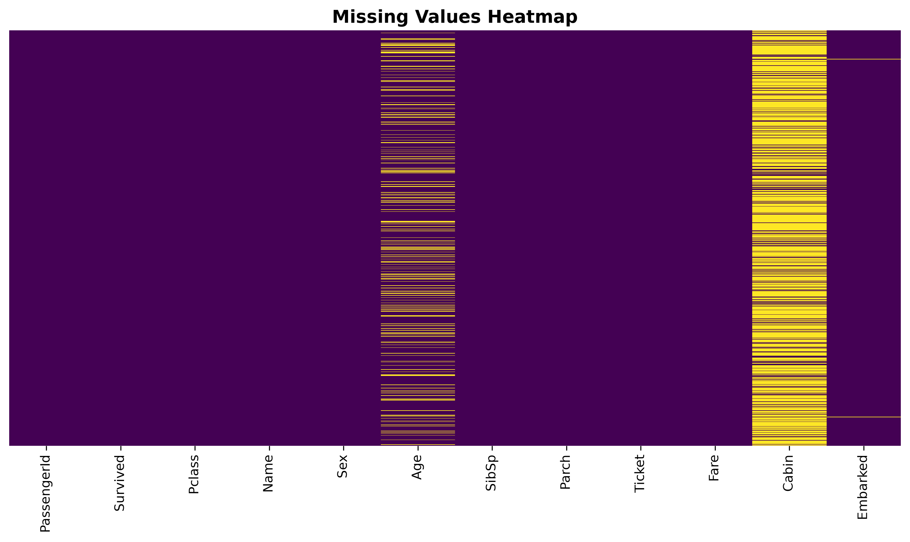

##### Demographics:
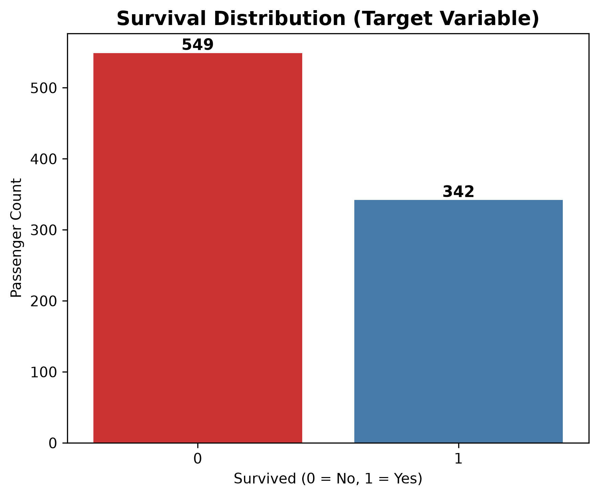
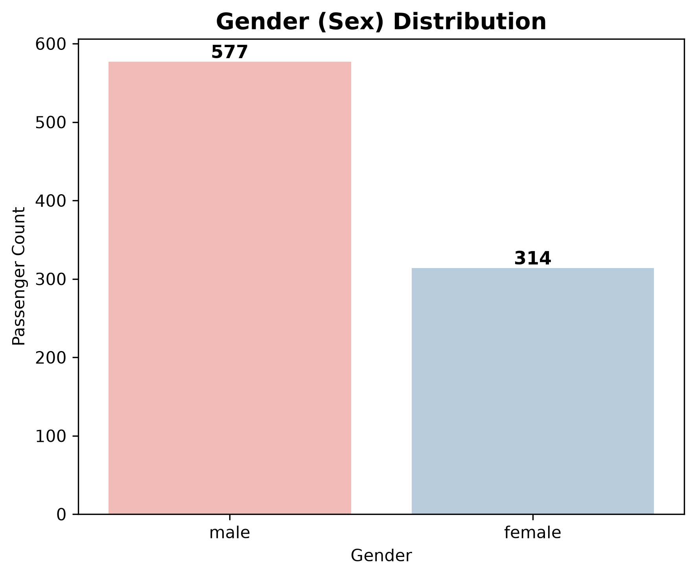
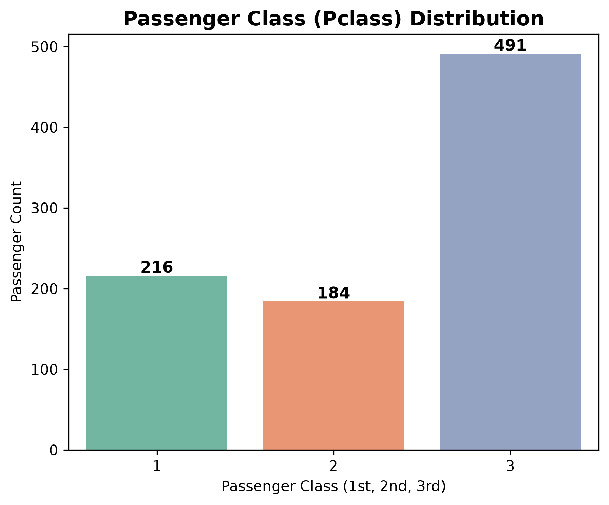
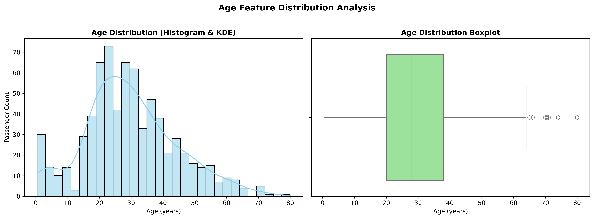
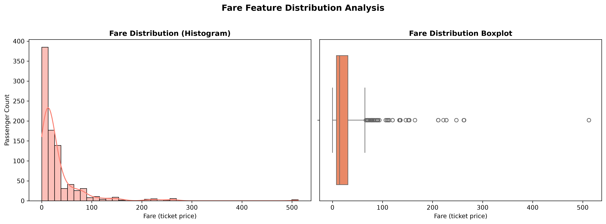

##### Survival Relationships:
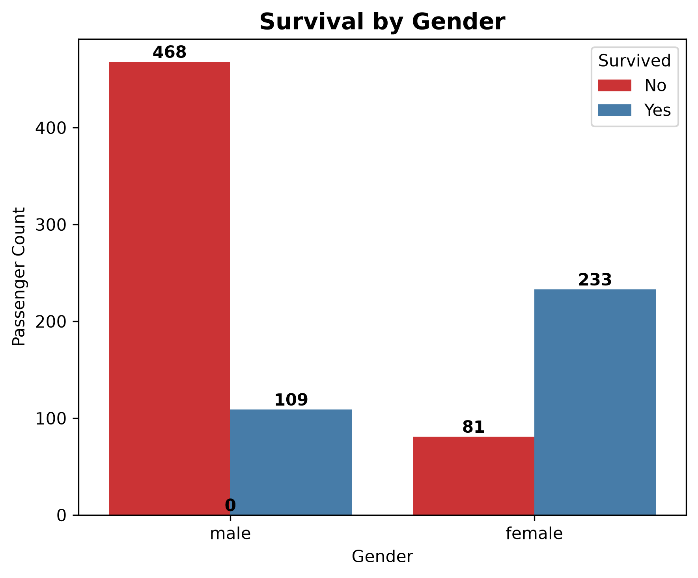
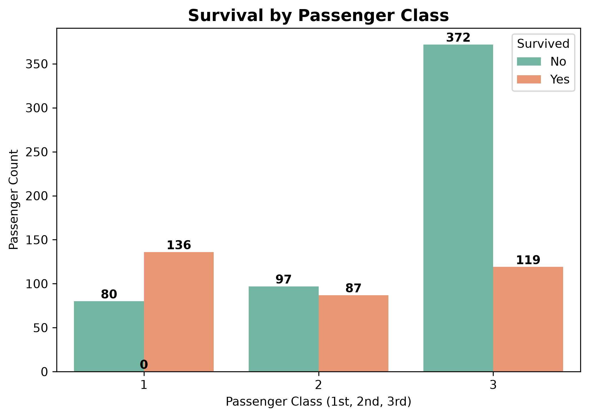

##### Numerical Correlations:
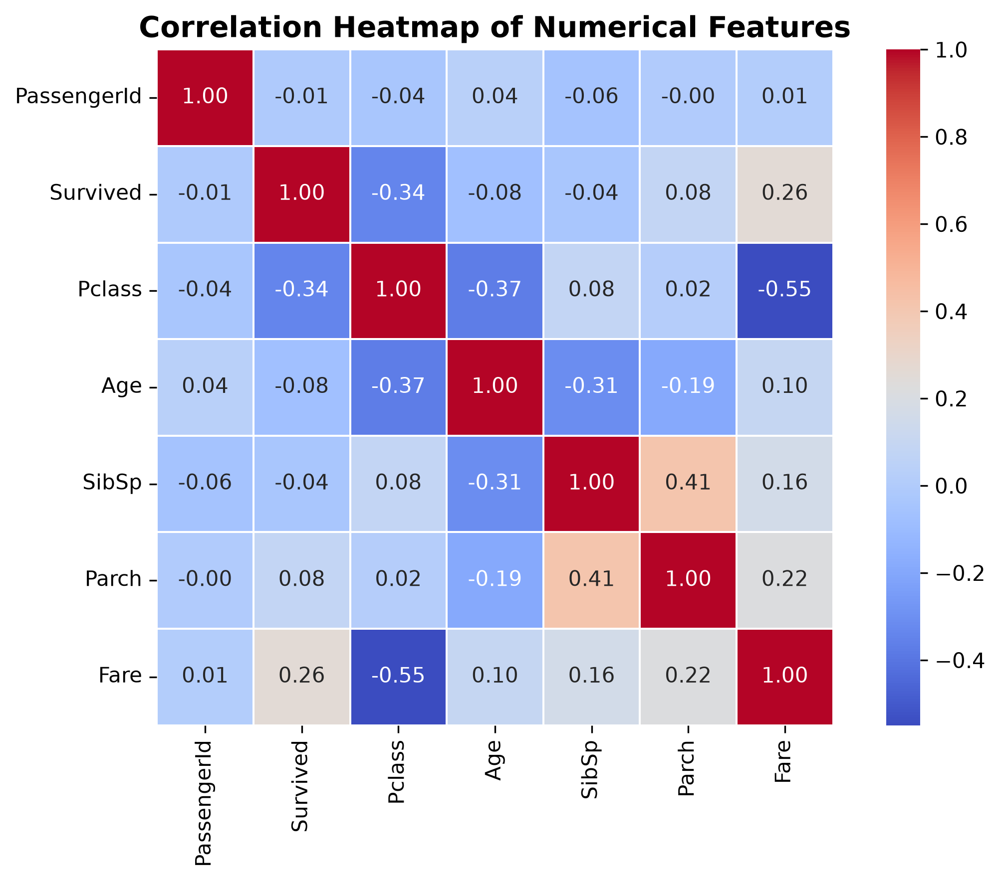

---

## ⚙️ Preprocessing & Feature Engineering

1. **New Columns**:
   - `FamilySize` = `SibSp` + `Parch` + 1
   - `IsAlone` = 1 if `FamilySize == 1` else 0.
2. **Encoding**:
   - `Sex`: Binary label mapped (`female` -> 0, `male` -> 1).
   - `Embarked`: One-hot encoded to integer dummies (`Embarked_Q`, `Embarked_S`).
3. **Column Drops**: Dropped metadata identifiers `PassengerId`, `Name`, `Ticket` to prevent overfitting. Excluded `Cabin` from the final machine learning features matrix $X$ since it remains non-encoded.

---

## 🤖 Models & Performance Comparison

We performed a stratified 80-20 train-test split (`random_state=42`) and evaluated 6 classification algorithms on the test partition:

| Model | Accuracy | Precision | Recall | F1-Score |
| :--- | :---: | :---: | :---: | :---: |
| **Random Forest** | **82.68%** | **78.79%** | **75.36%** | **0.7704** |
| **Logistic Regression** | 80.45% | 78.33% | 68.12% | 0.7287 |
| **Gaussian Naive Bayes** | 78.21% | 71.43% | 72.46% | 0.7194 |
| **Decision Tree** | 77.65% | 72.31% | 68.12% | 0.7015 |
| **K-Nearest Neighbors (KNN)** | 67.60% | 58.73% | 53.62% | 0.5606 |
| **Support Vector Machine (SVM)** | 62.57% | 53.33% | 23.19% | 0.3232 |

##### Model Testing Accuracy Comparison:
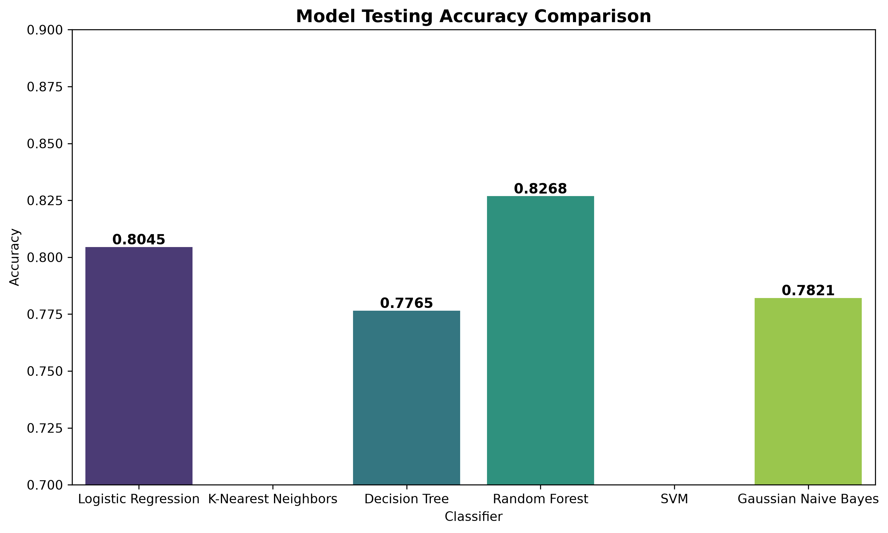

---

## 🏆 Selected Best Model Evaluation

The **Random Forest Classifier** achieved the highest accuracy of **82.68%**.

* **5-Fold Cross-Validation Accuracy**: **81.93%** (showing the model is stable and does not suffer from overfitting).
* **AUC Score**: **0.8655** (excellent discrimination ability).

##### Best Model Diagnostics:
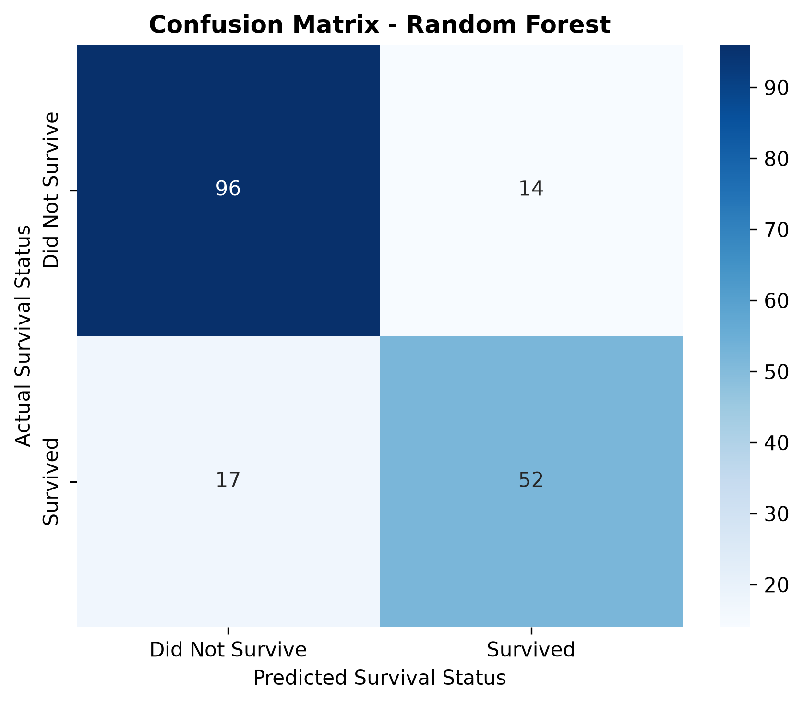
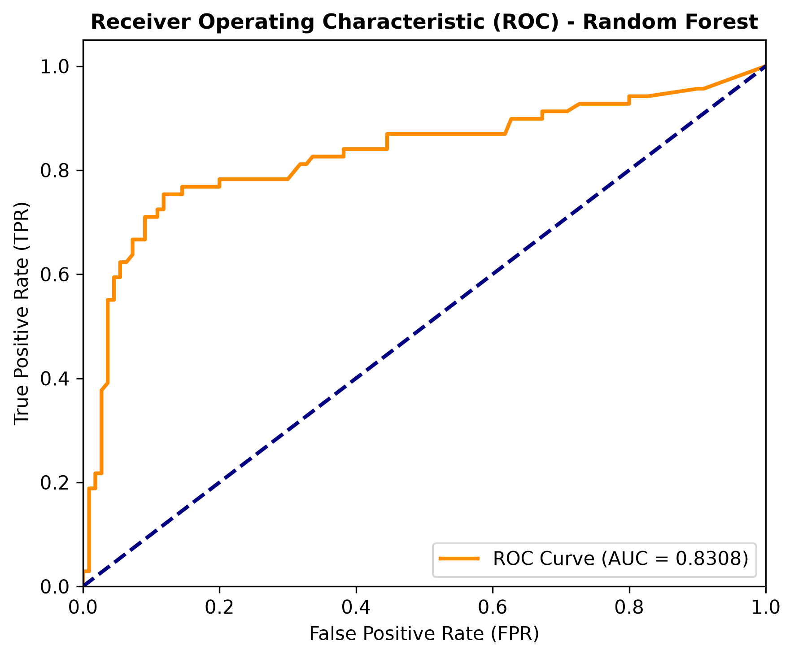

---

## 💾 Model Loading & Verification

The best model is saved at `models/best_titanic_model.joblib`. 

To load the model and make predictions on new passenger data, run the following Python code:

```python
import joblib
import pandas as pd

# 1. Load the model
model = joblib.load('models/best_titanic_model.joblib')

# 2. Define a new passenger sample
# Features: [Pclass, Sex (0=F, 1=M), Age, SibSp, Parch, Fare, FamilySize, IsAlone, Embarked_Q, Embarked_S]
# Example: 1st class female passenger, 30 years old, travelling alone, paid 80.0 fare, embarked Southampton
sample_passenger = pd.DataFrame([[1, 0, 30.0, 0, 0, 80.0, 1, 1, 0, 1]], 
                                columns=['Pclass', 'Sex', 'Age', 'SibSp', 'Parch', 'Fare', 
                                         'FamilySize', 'IsAlone', 'Embarked_Q', 'Embarked_S'])

# 3. Predict survival
prediction = model.predict(sample_passenger)
print(f"Survival Prediction: {'Survived' if prediction[0] == 1 else 'Did Not Survive'}")
# Output: Survival Prediction: Survived
```
