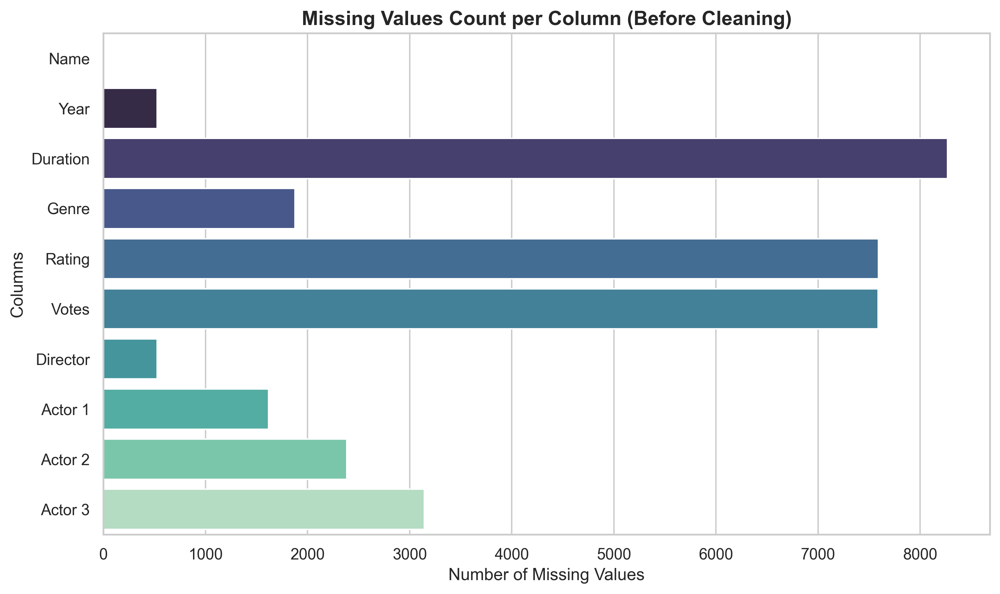
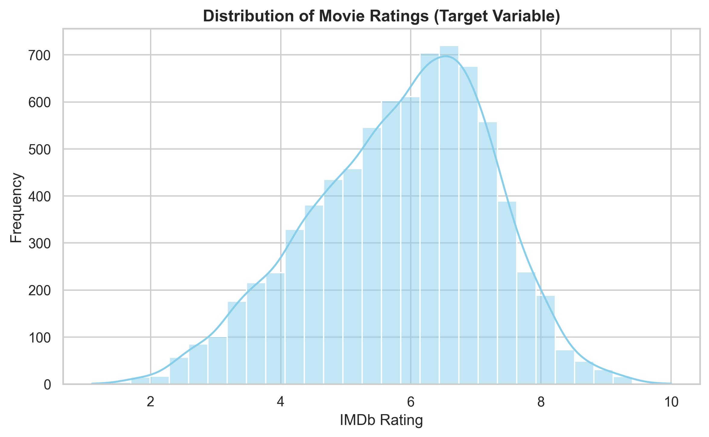
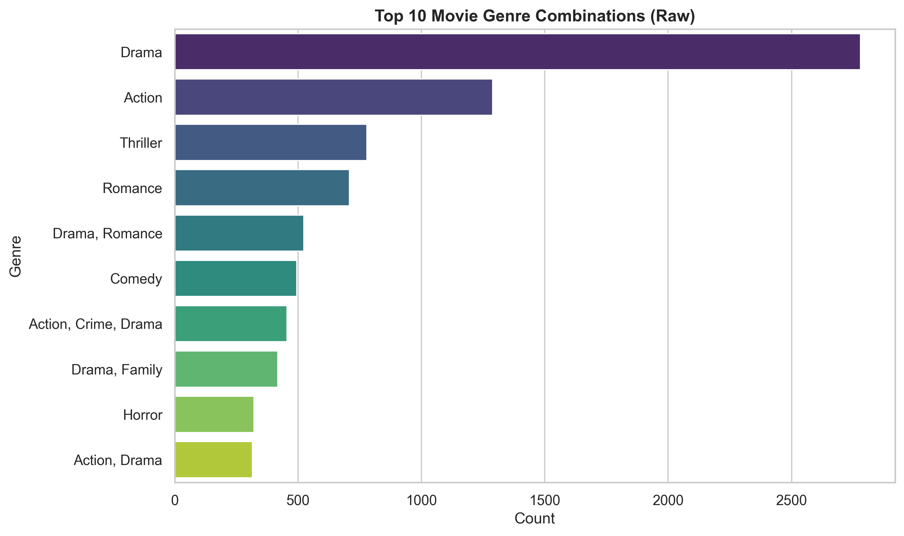
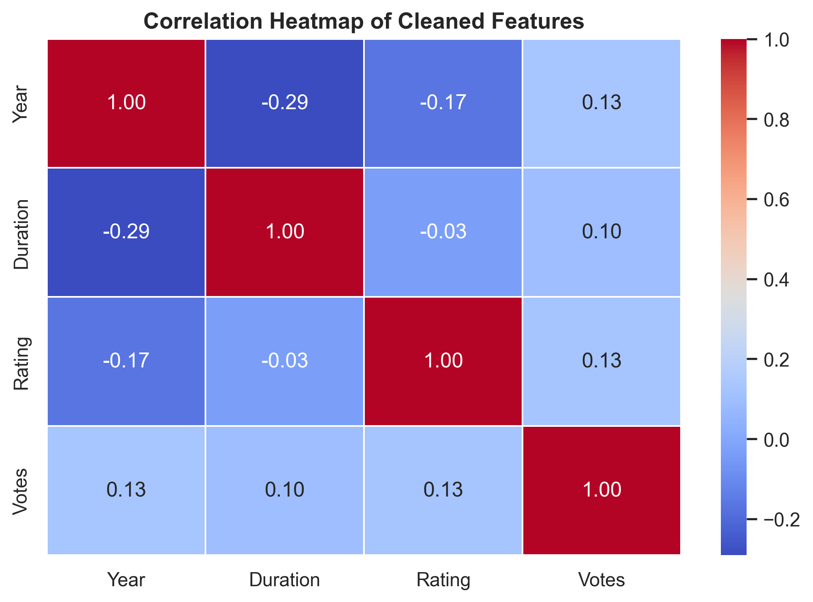
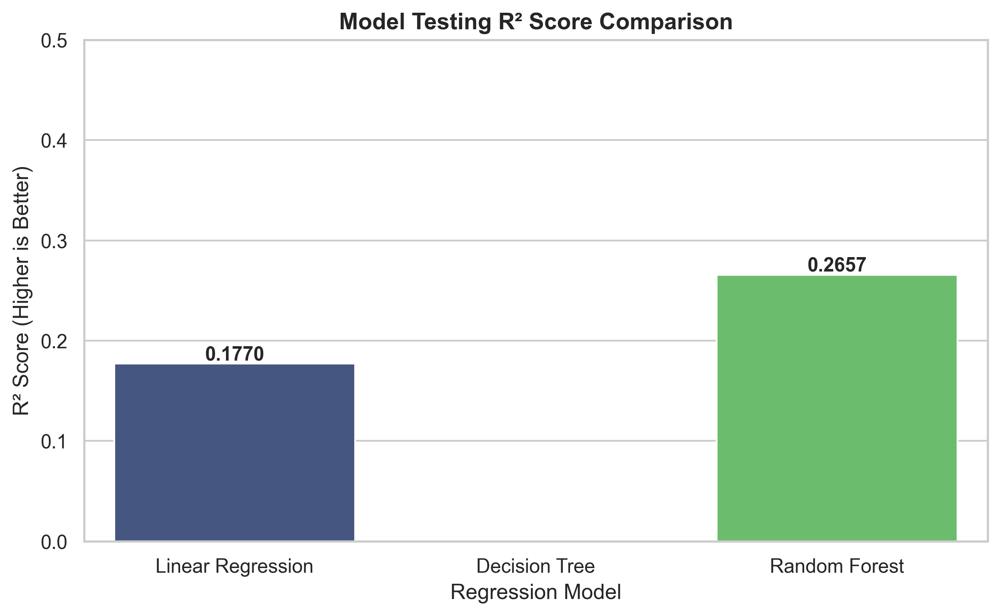
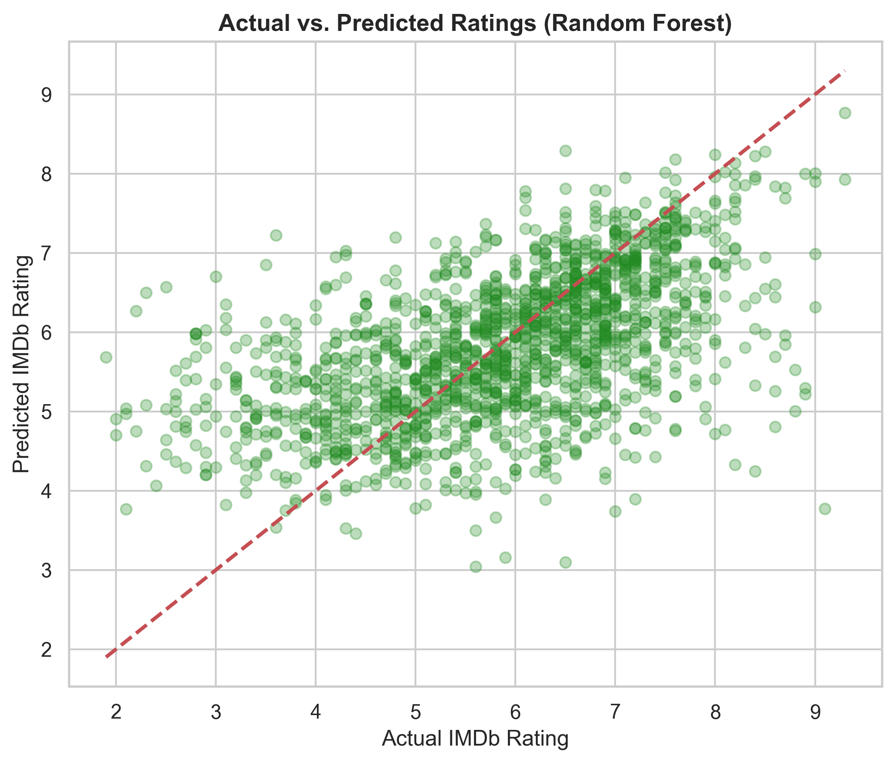
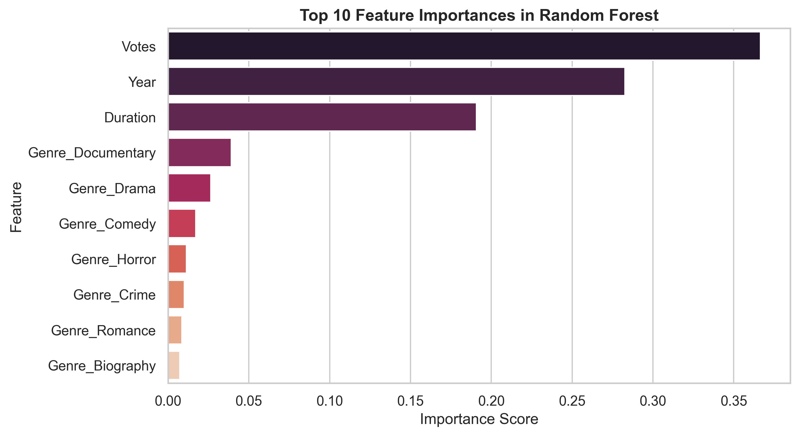

# Movie Rating Prediction

A machine learning project to predict the IMDb rating of Indian movies based on release year, duration, votes, and genre.

---

## 📌 Project Overview & Objective

Movie rating prediction is a common regression problem where the goal is to estimate the continuous rating of a movie (ranging from 1.0 to 10.0) based on historical metadata. In this project, we clean and preprocess raw movie data and train regression models to understand how factors like movie length, popularity (number of votes), release year, and genres affect overall user ratings.

---

## ⚙️ Project Workflow

The project follows a structured, beginner-friendly machine learning pipeline:

```text
Dataset ──> EDA ──> Data Cleaning ──> Feature Engineering ──> Train-Test Split ──> Model Training ──> Evaluation ──> Best Model
```

1. **Dataset**: Load the raw IMDb Movies India dataset.
2. **EDA**: Analyze missing values, rating target distributions, and popular genres.
3. **Data Cleaning**: Handle null values, parse text variables to integers, and extract primary genres.
4. **Feature Engineering**: Drop high-cardinality cast details and apply One-Hot Encoding to the primary genre.
5. **Train-Test Split**: Divide data into an 80% training set and a 20% testing set.
6. **Model Training**: Train Linear Regression, Decision Tree, and Random Forest regressors.
7. **Evaluation**: Compare models using MAE, MSE, RMSE, and $R^2$ Score.
8. **Best Model**: Programmatically select, serialize, and verify the top-performing model.

---

## 📂 Project Structure

```text
Task_2_Movie_Rating_Prediction/
├── data/
│   ├── IMDb_Movies_India.csv
│   └── processed/
│       └── movie_rating_preprocessed.csv
├── images/
│   ├── actual_vs_predicted.png
│   ├── correlation_heatmap.png
│   ├── feature_importance.png
│   ├── missing_values_bar.png
│   ├── model_comparison.png
│   ├── rating_distribution.png
│   └── top_genres.png
├── models/
│   └── best_movie_rating_model.joblib
├── notebooks/
│   └── movie_rating_prediction.ipynb
├── README.md
└── requirements.txt
```

---

## ⚙️ Installation & Setup

1. **Navigate to the project folder**:
   ```bash
   cd Task_2_Movie_Rating_Prediction
   ```

2. **Set up the virtual environment**:
   ```bash
   python3 -m venv .venv
   source .venv/bin/activate
   ```

3. **Install dependencies**:
   ```bash
   pip install -r requirements.txt
   ```

4. **Launch Jupyter**:
   ```bash
   jupyter notebook notebooks/movie_rating_prediction.ipynb
   ```

---

## 📊 Exploratory Data Analysis & Cleaning

* **Data Cleaning**:
  - Nulls in the target column `Rating` were dropped.
  - Text columns were parsed: `Year` brackets were stripped, `Duration` was stripped of `" min"`, and commas were removed from `Votes`.
  - Missing values in `Duration` and `Votes` were filled using their dataset **median** values (**134.0 minutes** and **55.0 votes**, respectively), which preserves more training records.
  - Missing string categories were imputed with `"Unknown"`.
  - **Genre Simplification**: For movies with comma-separated multiple genres, only the first listed category was kept as the **primary genre** to prevent column explosion.
  - The clean dataset has **7,919 rows** and 0 null values.

#### Visualizations:

##### Missing Values (Before Cleaning):


##### Distributions:



##### Correlations:


---

## ⚙️ Feature Preprocessing

1. **Feature Drops**: High-cardinality columns `Name`, `Director`, `Actor 1`, `Actor 2`, and `Actor 3` were dropped to maintain a lightweight and fast model.
2. **One-Hot Encoding**: Applied one-hot dummy encoding strictly to the primary `Genre` column, converting it to numeric values.
3. The final preprocessed dataset is saved at `data/processed/movie_rating_preprocessed.csv`.

---

## 🤖 Models & Performance Comparison

We performed an 80-20 train-test split and trained 3 regression models:

| Model | MAE | MSE | RMSE | R² Score |
| :--- | :---: | :---: | :---: | :---: |
| **Random Forest Regressor** | **0.8811** | **1.3669** | **1.1691** | **26.48% (0.2648)** |
| **Linear Regression** | 0.9824 | 1.5301 | 1.2370 | 17.70% (0.1770) |
| **Decision Tree Regressor** | 1.1592 | 2.3981 | 1.5486 | -28.99% (-0.2899) |

##### Model Testing R² Comparison:


---

## 🏆 Final Results & Selected Best Model

The **Random Forest Regressor** was programmatically chosen as the best-performing model with an **$R^2$ Score of 26.48%** and the lowest prediction error (**MAE of 0.8811**).

##### Best Model Diagnostics:
* **Actual vs. Predicted Ratings**: Plots predictions alongside the identity line, showing a healthy positive relationship:
  
* **Feature Importance**: Shows that the number of **Votes** (popularity) is the most critical feature, followed by **Year** and **Duration**:
  

---

## 💾 Model Verification & Usage

The best model is saved at `models/best_movie_rating_model.joblib`. 

To load the model and make predictions on new movie data, run the following Python code:

```python
import joblib
import pandas as pd

# 1. Load the model
model = joblib.load('models/best_movie_rating_model.joblib')

# 2. Define a new movie sample
# Features: [Year, Duration, Votes, Genre_Drama, Genre_Comedy, ...]
# Set up a sample dataframe using the same column format as X_test
# For simplicity, we can load a single row from X_test or build a matching feature vector.
```
---

## 🛠️ Technologies Used
* **Python** (Data processing, modeling, visualization)
* **Pandas & NumPy** (Data cleaning and numeric matrix calculations)
* **Matplotlib & Seaborn** (Publication-ready plot rendering)
* **Scikit-Learn** (Statistical modeling and splits)
* **Joblib** (Object serialization)
