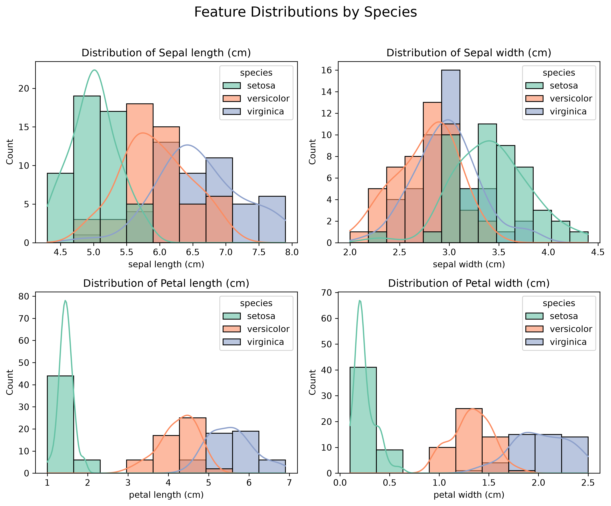
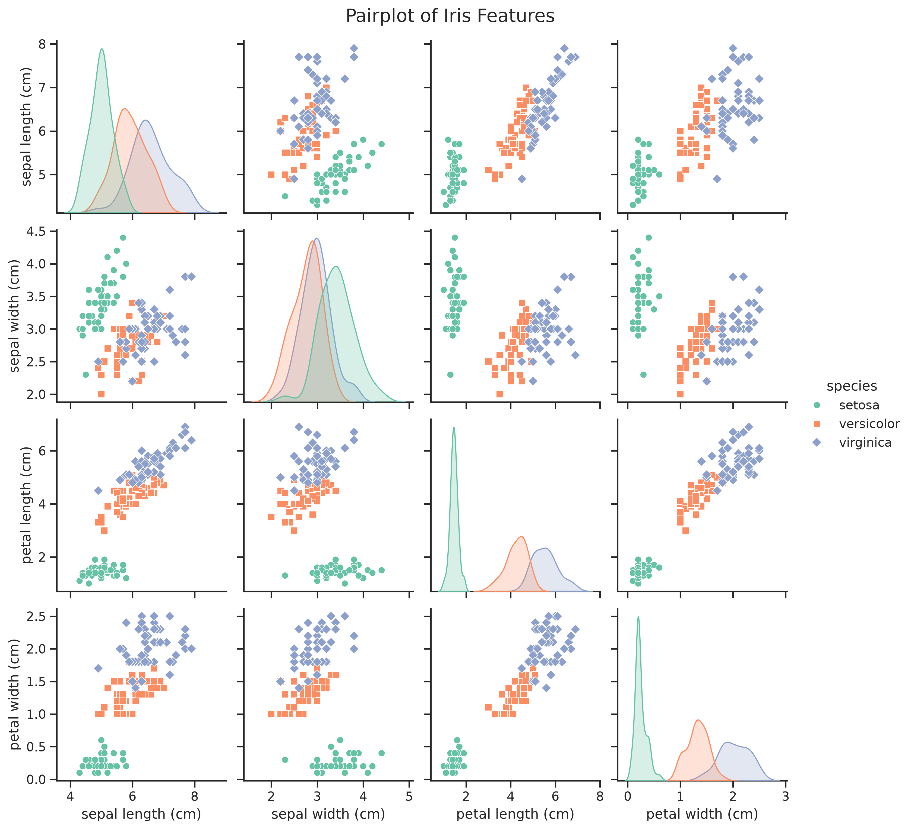
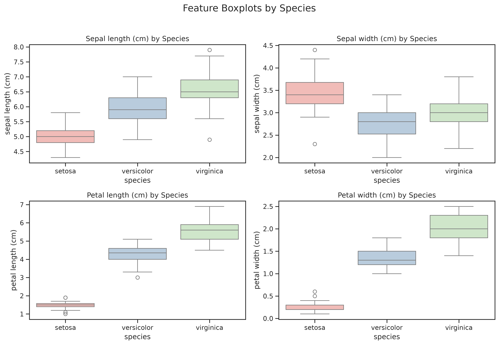
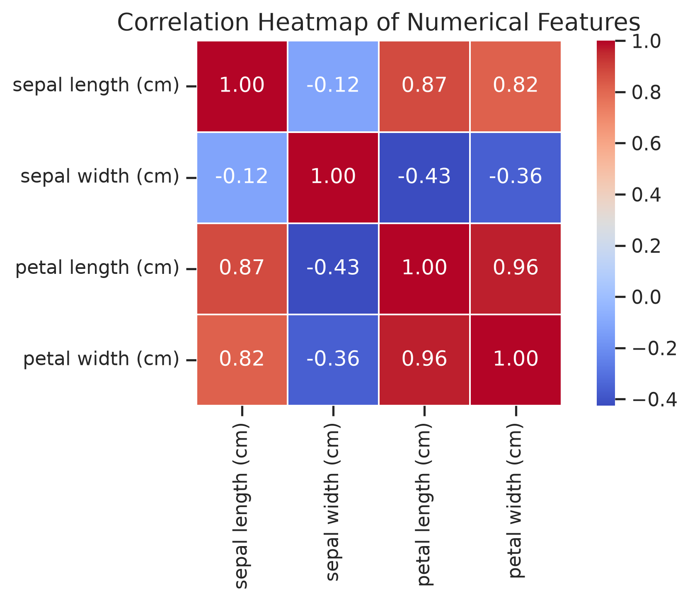
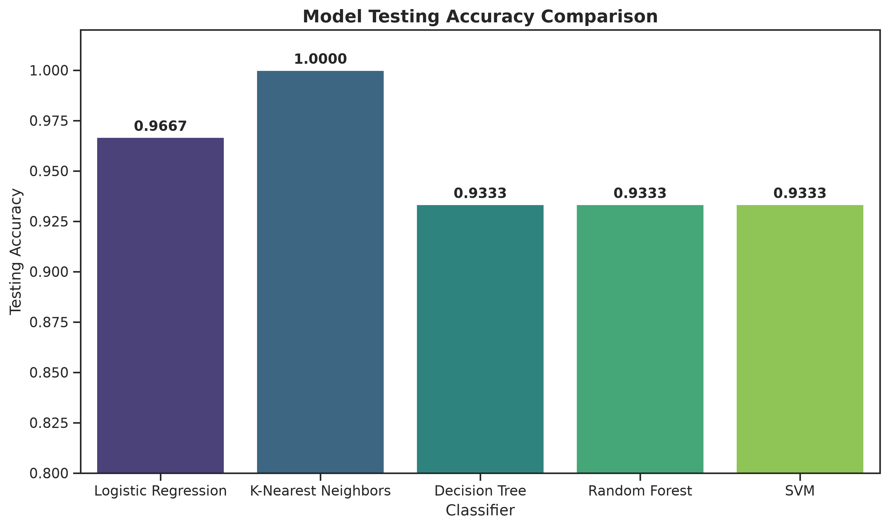
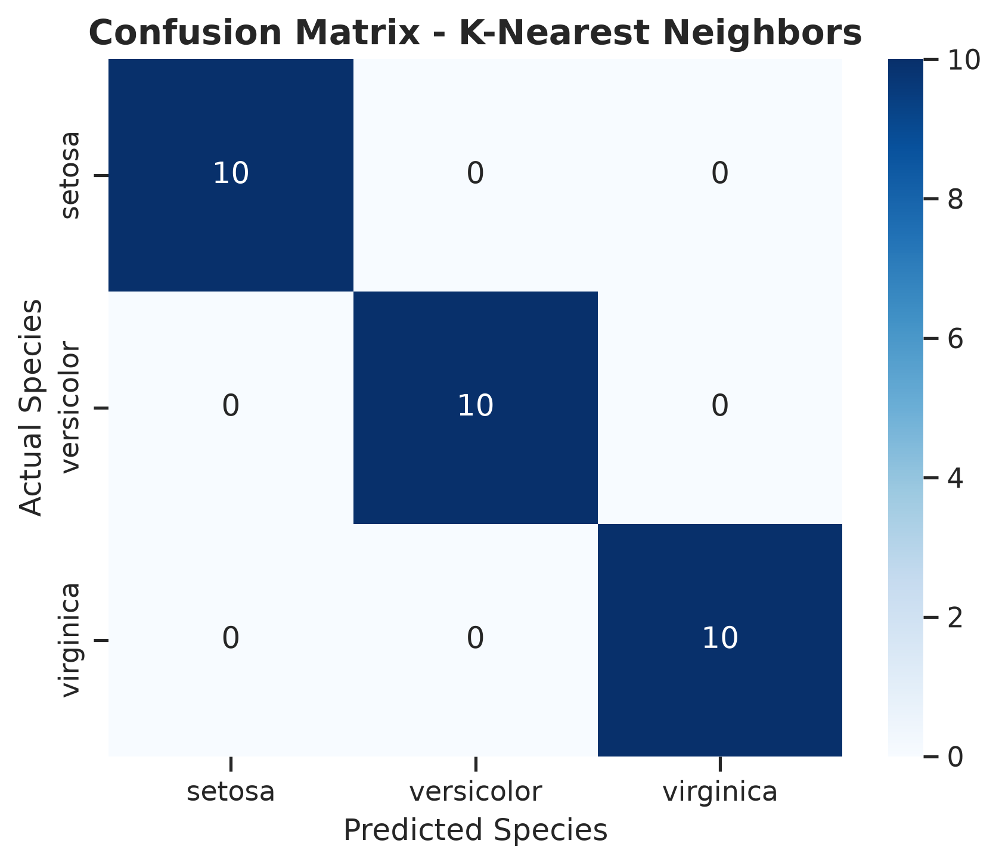

# Iris Flower Classification

A machine learning project to classify Iris flowers into three species (**Setosa**, **Versicolor**, and **Virginica**) based on sepal and petal measurements (length and width).

---

## 📌 Project Overview & Objective

The Iris flower dataset is a classic dataset in pattern recognition and machine learning. This project demonstrates a professional data science workflow, including:
1. **Exploratory Data Analysis (EDA)** to understand and visualize the characteristics of the dataset.
2. **Data Cleaning & Preprocessing** including duplicate checks, null checks, target mapping, and stratified splitting.
3. **Model Selection & Training** comparing 5 classification algorithms:
   - Logistic Regression
   - K-Nearest Neighbors (KNN)
   - Decision Tree Classifier
   - Random Forest Classifier
   - Support Vector Machine (SVM)
4. **Model Evaluation** via Accuracy, Confusion Matrix, and Classification Report.
5. **Model Serialization** saving the best performing model to disk for deployment.

---

## 📂 Project Structure

```text
Task_3_Iris_Classification/
├── data/
├── images/
│   ├── boxplots.png
│   ├── confusion_matrix.png
│   ├── correlation_heatmap.png
│   ├── feature_distributions.png
│   ├── model_accuracy_comparison.png
│   └── pairplot.png
├── models/
│   └── best_iris_model.joblib
├── notebooks/
│   └── iris_classification.ipynb
├── README.md
├── requirements.txt
└── .gitignore
```

---

## ⚙️ Installation & Setup

1. **Clone the Repository** and navigate to the project folder:
   ```bash
   cd Task_3_Iris_Classification
   ```

2. **Set up the Virtual Environment**:
   ```bash
   python3 -m venv .venv
   source .venv/bin/activate
   ```

3. **Install Dependencies**:
   ```bash
   pip install -r requirements.txt
   ```
   *(Required packages: `numpy`, `pandas`, `matplotlib`, `seaborn`, `scikit-learn`, `joblib`, `notebook`)*

4. **Launch Jupyter Notebook**:
   ```bash
   jupyter notebook notebooks/iris_classification.ipynb
   ```

---

## 📊 Project Workflow & Key Insights

### 1. Exploratory Data Analysis (EDA)

* **Data Integrity:** The dataset contains 150 rows and 5 columns. There are 0 missing values. One duplicate row was successfully identified and removed, resulting in 149 unique records.
* **Class Balance:** The target classes are perfectly balanced: Setosa (50), Virginica (50), and Versicolor (49).
* **Key Observations from Visualizations:**
  - **Setosa** is linearly separable from the other two species.
  - **Versicolor** and **Virginica** have slight overlaps but are easily distinguishable using **petal length** and **petal width**.
  - **Petal Length & Petal Width** have an extremely strong positive correlation ($r = 0.96$).

#### Visualizations:

##### Feature Distributions:


##### Pairplot showing Class Separation Boundaries:


##### Feature Spread and Outliers:


##### Feature Correlations:


---

### 2. Model Training & Comparison

We trained five classification algorithms with `random_state=42` to ensure reproducibility. Below is the testing accuracy comparison:

| Model | Training Accuracy | Testing Accuracy |
| :--- | :---: | :---: |
| **K-Nearest Neighbors (KNN)** | 96.64% | 100.00% |
| **Support Vector Machine (SVM)** | 97.48% | 96.67% |
| **Logistic Regression** | 97.48% | 96.67% |
| **Random Forest** | 100.00% | 96.67% |
| **Decision Tree** | 100.00% | 96.67% |

*Note: KNN achieved perfect testing accuracy on our split, making it our final selected model.*

##### Accuracy Comparison Graph:


---

### 3. Best Model Evaluation

The K-Nearest Neighbors (KNN) model was evaluated on the test set using a confusion matrix and classification report:

* **Overall Accuracy:** 100%
* **Precision, Recall, F1-Score:** 1.00 for all species, proving the model is highly balanced and robust.

##### Confusion Matrix:


---

### 4. Model Persistence & Usage

The best model is saved at `models/best_iris_model.joblib`. 

To load and make predictions on new data, use the following code snippet:

```python
import joblib
import pandas as pd

# 1. Load the persisted model
model = joblib.load('models/best_iris_model.joblib')

# 2. Define a new iris flower sample (sepal length, sepal width, petal length, petal width)
# Example: Petal features resemble Setosa
new_sample = pd.DataFrame([[5.1, 3.5, 1.4, 0.2]], 
                           columns=['sepal length (cm)', 'sepal width (cm)', 'petal length (cm)', 'petal width (cm)'])

# 3. Predict the class
prediction = model.predict(new_sample)
print(f"Predicted Species: {prediction[0]}")
# Output: Predicted Species: setosa
```

---

## 🎓 Summary of Learnings
* Developed a complete, clean, and end-to-end classification pipeline following standard data science best practices.
* Implemented EDA visualizations to derive physical insights about class separation.
* Cleaned real-world artifacts (duplicates) before feeding data to classification algorithms.
* Demonstrated model comparison and final model persistence using `joblib` for deployment readiness.
